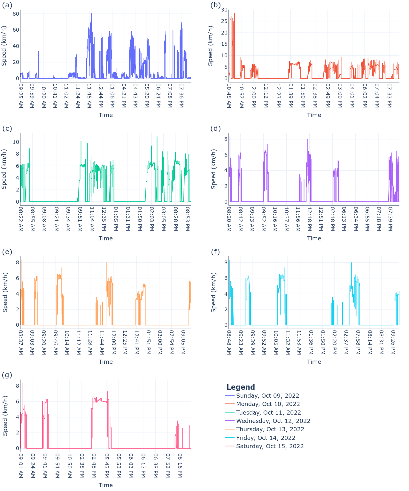

# Which is more fun: Weekdays or weekends?

## Tech Stack

|<a href="https://www.qgis.org/en/site/">

</a>|<a href="https://www.python.org/">

</a>|<a href="https://numpy.org/">

</a>
|---|---|---|

|<a href="https://pandas.pydata.org/">

</a>|<a href="https://plotly.com/python/">

</a>|
|---|---|

## Problem Statement

Urban spaces are shaped by people's spatiotemporal activities. Analyzing the demands of
various social groups and individual differences is necessary in order to develop policies and
commercial centers that are based on the needs of the people. Historically mobility patterns
and routes were recorded using traditional techniques like travel diaries to obtain
spatiotemporal information about individuals. However, these techniques have their own
limitations in terms of accuracy and reliability. Modern geo-information technologies, such
as GPS-enabled smartphones, can now be used to gather precise and reliable data. The ability
to gather a large amount of information while also being precisely localized is a key
advantage of such technologies. GPS data can be used to track user mobility and provide
valuable insights into the user's preferences and lifestyle habits. These insights can be used to
offer location-based services on a large scale, such as assisting cities in deciding where bus
routes should be formed to benefit the largest number of people, notifying drivers about slow
traffic, assisting businesses in locating high-traffic areas, providing advertisements about
businesses along one’s intended route, etc.

The IISER Bhopal campus in Bhopal, India, serves as the region of interest for the study. This study aims to analyze the spatiotemporal mobility patterns on a college campus through
smartphone-based GPS monitoring over a week to identify and assess a single student's key
daily actions, priorities, and unusual behaviors and compare mobility patterns on weekdays
and weekends. The spatial mobility patterns are analyzed using simple mobility indicators
such as speed, time spent, and mode of transportation, as well as identifying regions of
concentration of specific trajectories within the study area. The study's findings could be
valuable for monitoring campus security, finding hot spots on campus, improving campus
amenities, and learning more about students' mobility patterns.

## Objectives

This study illustrates the idea of GPS-based intelligence by monitoring a single university student's spatiotemporal attributes and behavior over a week using a smartphone-based GPS
receiver and displaying the data on a geographic information system (GIS). In particular, this
study aims to comprehend the following behavioral characteristics displayed by the student:

- Analyze the student's daily schedule for a week.
- Analyze sudden variations in routine and behavior over the weekends.
- Find the student's preferred route, especially on working weekdays.
- Identify the student's mode of transportation.

## Methodology

In this study, a 21-year-old college student's daily movements were monitored for one week,
from Sunday, October 09, 2022, to Saturday, October 15, 2022. The participant resided in
Bhopal, India, throughout the course of the study and carried a smartphone with the GPS
Logger [1] application installed on it. The application was configured to collect location
information each second. The following guidelines were followed for data collection:

<ul>
<li align="justify">As soon as the student leaves his residence (i.e., hostel) at the beginning of each day, the
GPS Logger application is started. The student turns off the application when he returns
to the hostel at the end of the day.</li>
<li align="justify">While walking and traveling, the student always kept the smartphone-based GPS device
in his pocket or bag.</li>
<li align="justify">When the student spent more time inside buildings than outside, it was most difficult to measure its movement. Due to the "urban canyon effect," [2] signal loss and searching for
a signal frequently happened inside buildings. As a result, the automatic search for a
signal started again, often generating several incorrect position coordinates.</li>
</ul>

At the end of each day, the data was imported into the QGIS software and visualized
before being used for calculations and data analysis. Additionally, the Time Manager [3]
plugin is used to identify the daily commute route and examine the mobility pattern. The
kernel density estimation technique is used to identify hotspots in the form of heatmaps by
estimating the density based on the number of points in a particular location, with larger
numbers of clustered points translating into larger values. In an effort to determine the
method of transportation for a specific timeframe, the change in speed over time is also
analyzed.

## Results

Figure 1 shows the student's commute path on Sunday, October 09, 2022, while Figure 2
shows the student's travel route from Monday, October 10, 2022, to Saturday, October 15,
2022. Figure 1 makes apparent that the student visited Aashima Anupama Mall outside of the
IISER Bhopal campus. While Figure 2 shows that the mobility pattern is monotonous during
the weekdays. It's interesting to observe that the student's mobility pattern on Saturday,
shown in Figure 2(f), is considerably different from previous days because, in contrast to
other days, the student never left the hostel area. It is quite apparent that the student mobility
patterns are pretty similar during the weekdays and drastically different during the weekend.

<figure>

<figcaption style="text-align: center"><b>Figure 1. </b>Map showing the GPS travel trajectories of a college student on Sunday, October 09, 2022.</figcaption>

</figure>

<figure>

<figcaption style="text-align: center"><b>Figure 2. </b>Maps showing the GPS travel trajectories of a university student on (a) Monday, October 10, 2022 (b) Tuesday, October 11, 2022, (c) Wednesday, October 12, 2022 (d)
Thursday, October 13, 2022, (e) Friday, October 14, 2022 (f) Saturday, October 15, 2022.</figcaption>

</figure>

<figure>

<figcaption style="text-align: center"><b>Figure 3. </b>GPS track heatmap showing the hotspots on Sunday, October 09, 2022.</figcaption>

</figure>

<figure>

<figcaption style="text-align: center"><b>Figure 4. </b>GPS track heatmaps showing the hotspots on (a) Monday, October 10, 2022 (b) Tuesday, October 11, 2022, (c) Wednesday, October 12, 2022 (d) Thursday, October 13, 2022, (e) Friday, October 14, 2022 (f) Saturday, October 15, 2022.</figcaption>

</figure>

Figures 3 and 4 depict the heatmaps generated from the GPS data, which provide a more
in-depth look at the student's mobility by visually displaying how much time the student spent in
each hotspot. The heatmaps depicted in Figures 3 and 4 were visualized using the Time Manager
plugin in QGIS. Figures 3 and 4 illustrate that the student stays in Hostel 7 and eats at Mess 5.
On Sunday (see Figure 3), he boarded a bus at the college's main gate and traveled to the
Aashima Anupama Mall, where he spent a considerable amount of time, most likely watching a
movie. He then encountered some traffic while traveling to Lalghati after waiting for the bus at
the bus stop near the mall. He presumably spent some time in a restaurant in Lalghati before
moving on to an ice cream parlor and spending some time there as well. After that, he went to
the Lalghati bus stop to wait for the bus to make his way back to the college's campus.

Now, if we compare the student's mobility patterns on Sunday and during the weekdays,
we will see a clear distinction between the two. The student adheres to a very rigid travel
schedule that is mostly focused on getting to and from the hostel, mess, lecture hall complex
(LHC), and main building. Over the course of the study, the student's mobility pattern is rather
consistent and monotonous from Monday to Friday. It's also interesting to note that the mobility
pattern again drastically changed on Saturday when the student spent the entire day in the hostel
area and only left the hostel to dine in the mess. Figures 4 (c), (e), and (f) highlight some minor
details, showing that the student spent some time at the Ideation Hut and on benches near the
cricket field's boundary, perhaps for socializing and interacting with other students. The student's
one-way and two-way routes are depicted on the mobility graph for weekdays and weekends in
Figure 5.

<figure>

<figcaption style="text-align: center"><b>Figure 5. </b>Graph illustrating the difference between weekdays and weekends in terms of mobility.</figcaption>

</figure>

The most used path is determined by first combining all the tracks into one shapefile and
using the “Line Density” tool from QGIS. Figure 6 depicts the student's preferred routes
throughout the course of the study. The student could be seen to routinely take two routes, one
from Hostel 7 to Mess 5 and another from Hostel 7 to the lecture hall complex (LHC).
Additionally, it can be seen that the student hardly ever uses the road that runs along the hillside
and only chooses to use it on weekends when he leaves campus.

<figure>

<figcaption style="text-align: center"><b>Figure 6. </b>(a) Combined mobility tracks of the student within the campus, (b) Line density plot showing most used paths by the student within the campus.</figcaption>

</figure>

Throughout the study, the student's speed is also analyzed, depicted in Table 1 and Figure
7. Figure 7(a) shows that on Sunday, October 9, 2022, when the student was traveling outside the
campus, he attained a maximum speed of 80.64 km/h. It could be assumed that the student had
used the bus to get around the city. The maximum speed was 28.47 km/h on Monday, October
10, 2022, which is much faster than the maximum speed on other working weekdays. A closer
look at Figure 7(b) reveals that, in contrast to other days, the student turned on his GPS Logger
app very late, at around 10:45 AM. This, combined with the fact that the student's speed at this
time was at its maximum, raises the possibility that the student was running behind schedule for
his 11:00 AM class and may have taken an e-rikshaw to get to the lecture hall complex (LHC). Figure 7 also demonstrates periodic gaps in the student's mobility where his speed is zero,
indicating periods when he might be in class, working in the lab, or eating in the mess.

<figure>

<figcaption style="text-align: center"><b>Figure 7. </b>Speed vs. time plots for each day.</figcaption>

</figure>

<b>Table 1. </b>Minimum, maximum, and average speeds for each day.

| **Day**                     | **Minimum Speed (km/h)** | **Maximum Speed (km/h)** | **Average Speed (km/h)** |
|-----------------------------|:---------------------------:|:---------------------------:|:---------------------------:|
| Sunday, October 09, 2022    |             0.00            |            80.64            |             7.31            |
| Monday, October 10, 2022    |             0.00            |            28.47            |             2.77            |
| Tuesday, October 11, 2022   |             0.00            |            10.90            |             2.15            |
| Wednesday, October 12, 2022 |             0.00            |             8.35            |             0.82            |
| Thursday, October 13, 2022  |             0.00            |            14.94            |             1.23            |
| Friday, October 14, 2022    |             0.00            |            17.92            |             1.75            |
| Saturday, October 15, 2022  |             0.00            |             8.28            |             0.87            |

## Discussions and Suggestions

This study attempted to map the spatiotemporal mobility patterns of a single college student
and analyze his behaviors and priorities over a period of one week. The study provided
extremely thorough insights into the student’s daily mobility patterns and how it varies over
time, particularly on weekends when he takes a break from the monotonous routine to
socialize, enjoy, and explore the city. It also revealed a plethora of information about the
student and introduced us to a wide range of open research problems that can be further
investigated in future studies. One such problem is the early detection of depression in
college students using smartphone-based GPS data. Sohrab Saeb et al. leveraged mobile
phone sensor data, including GPS and phone usage, and provided behavioral markers that
were strongly related to depression [4]. Along similar lines, patterns in mobility behavior can
be used to measure depression passively. The following factors can be weighted together to
calculate the degree of depression:

<ul>
<li align="justify"><i>Confinement: </i>It can be determined by counting the number of times a particular student
leaves the hostel to go to classes or labs, as well as the total length of time that student
spends there. Also, examining whether or not a student participates in sports makes it
possible to determine the level of physical activity.</li>
<li align="justify"><i>Loss of appetite: </i>It can be easily measured by analyzing the mobility pattern of the
student around the dining halls, canteens, and other eateries within the campus. A
relationship between the student and lack of appetite can be established if the student is
skipping meals.</li>
<li align="justify"><i>Lack of interest in studies: </i>The number of times a student attends class each week can be calculated using GPS data. It can be presumed that a student who skips classes is dealing
with a problem that is causing them to lose interest in their academics.</li>
<li align="justify"><i>Disturbed sleep: </i>If a student leaves the hostel late at night or is awake during the night, sleeping disorders like insomnia can be detected from mobility patterns by analyzing and
quantifying the frequency of these kinds of incidents.</li>
</ul>

## References

<ol>
<li align="justify"><i>GPS Logger.</i> BasicAirData. Accessed: Oct. 20, 2022. [Android]. Available:
https://play.google.com/store/apps/details?id=eu.basicairdata.graziano.gpslogger&hl=en_IN
&gl=US</li>
<li align="justify">H. Gong, C. Chen, E. Bialostozky, and C. T. Lawson, “A GPS/GIS method for travel mode
detection in New York City,” <i>Comput. Environ. Urban Syst.</i>, vol. 36, no. 2, pp. 131–139,
Mar. 2012, doi: 10.1016/j.compenvurbsys.2011.05.003.</li>
<li align="justify">Anita Graser, Karolina Alexiou, and Seyed Javad Adabikhsoh, <i>TimeManager</i>. 2011.
Accessed: Oct. 21, 2022. [Online]. Available: https://plugins.qgis.org/plugins/timemanager/</li>
<li align="justify">S. Saeb et al., “Mobile Phone Sensor Correlates of Depressive Symptom Severity in
Daily-Life Behavior: An Exploratory Study,” <i>J. Med. Internet Res.</i>, vol. 17, no. 7, p. e4273,
Jul. 2015, doi: 10.2196/jmir.4273.</li>
</ol>